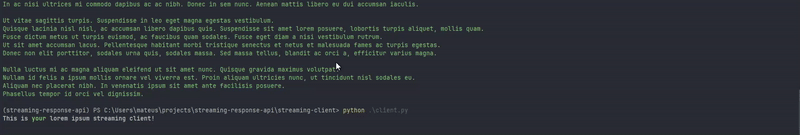

# Streaming Response API

Uma demonstração simples de API com respostas em streaming usando FastAPI e um cliente Python.



## Sobre o Projeto

Este projeto demonstra como implementar e consumir respostas em streaming HTTP, onde os dados são enviados gradualmente do servidor para o cliente, em vez de esperar que toda a resposta esteja pronta.

O projeto consiste em dois componentes principais:

1. **API de Streaming**: Um servidor FastAPI que envia texto Lorem Ipsum palavra por palavra com pequenos atrasos.
2. **Cliente de Streaming**: Um cliente Python que consome a API e exibe o texto recebido em tempo real com formatação colorida.

## Componentes

### API de Streaming

- Implementada com FastAPI
- Fornece um endpoint que transmite texto Lorem Ipsum palavra por palavra
- Adiciona um pequeno atraso entre cada palavra para simular uma resposta em tempo real

### Cliente de Streaming

- Implementado em Python usando a biblioteca Requests
- Utiliza a biblioteca Rich para exibir o texto recebido com formatação colorida
- Atualiza a exibição em tempo real conforme recebe novos dados

## Como Usar

### Requisitos

- Python 3.7+
- FastAPI
- Uvicorn
- Requests
- Rich

### Executando o Servidor

```bash
# Navegue até o diretório do projeto
cd streaming-response-api

# Inicie o servidor FastAPI
uvicorn streaming-api.main:app --reload
```

### Executando o Cliente

Em outro terminal:

```bash
# Navegue até o diretório do projeto
python client.py
```

## Benefícios das Respostas em Streaming

- **Tempo de Resposta Percebido**: Os usuários veem os resultados mais rapidamente
- **Experiência do Usuário**: Feedback visual imediato enquanto o conteúdo é carregado
- **Eficiência de Recursos**: Processamento e transmissão de dados em paralelo